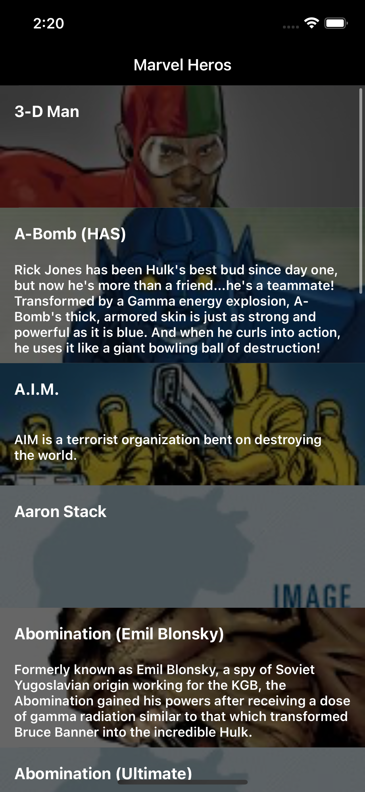
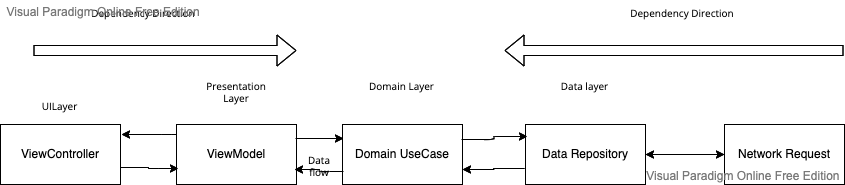

# Super Heros

This application created for demo purpose to list down the superhero of marvel comic and detail of the character.

Herolist Screen             |  Hero Detail
:-------------------------:|:-------------------------:
  |  

## Installation & How to Run

Use the pod to install the dependency [pod](https://cocoapods.org) to install.


- Download the code and install the cocoapods if not installed and install the dependency. Then open the SuperHeros.xcworkspace which will open the Xcode project. Then you can select debug scheme and any of your iPhone device to run the application.
- The application is having two scheme one is debug and other is release.
Inside plist Configuration plist property is added which is use for getting which configuration (debug/ release) selected.
Based on the Configuration the Environment object is initialized which is use throughout the application.
- Inside the environment enum public & private key is set for [Marvel API](https://developer.marvel.com) you can replace this api with your public and private key. 

```bash
pod install
```

## Technicals 

- The project created using Xcode 13.4.1 using swift 5.
- The Architecture used in the project is MVVM + Clean
 ### Third party library
> The application is using [Moya](https://github.com/Moya/Moya) framework for network layer.
> [Kingfisher](https://github.com/onevcat/Kingfisher) for fetching the image

## Architecture 

- Domain Layer (Business logic) is the inner-most part. It doesn't have any dependency. It contains Entities(Business Models), Use Cases, and Repository Interfaces. This layer could be reused within different projects. 
> Note: Domain Layer should not include anything from other layers(e.g Presentation — UIKit or SwiftUI or Data Layer)

- Presentation Layer contains UI (UIViewControllers). Views are coordinated by ViewModels which execute one or many Use Cases. Presentation Layer depends only on the Domain Layer.

- Data Layer contains Repository Implementations and one or many Data Sources. Repositories are responsible for coordinating data from different Data Sources. Data Source can be Remote or Local. Data Layer depends only on the Domain Layer. In this layer, we can also add mapping of Network JSON Data (e.g. Decodable conformance) to Domain Models.

- On the below graph every component from each layer is represented along with Dependency Direction and also the Data flow (Request/Response).


## Block Diagram

Block diagram
:-------------------------:



## Data Flow

- View(UI) calls method from ViewModel.
- ViewModel executes Use Case.
- Use Case collects data from Repositories.
- Each Repository returns data from a Remote Data (Network)
- Information flows back to the View(UI) where we display the list of items.

## Dependency Direction
- Presentation Layer -> Domain Layer <- Data Repositories Layer
- Presentation Layer (MVVM) = ViewModels + Views(UI)
- Domain Layer = Entities + Use Cases + Repositories Interfaces
- Data Repositories Layer = Repositories Implementations + Network Calls
